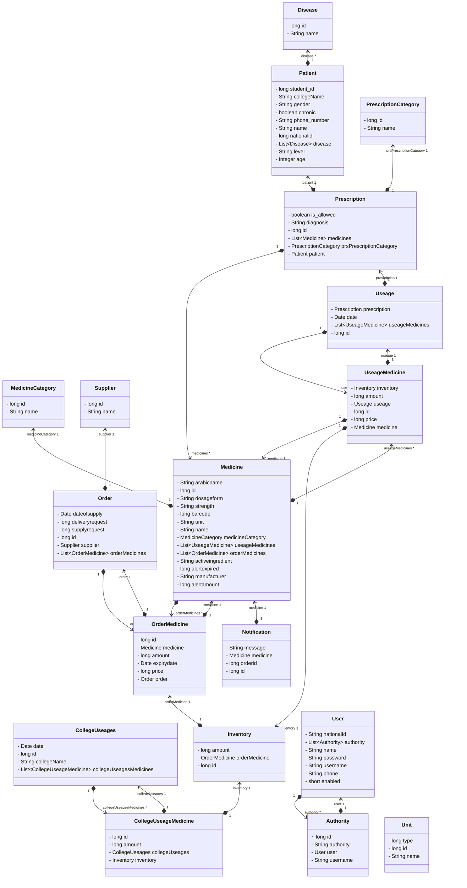

## Class Digrame

## Controllers Readme

This repository contains several controllers implemented in a Spring Boot application. Each controller handles specific HTTP endpoints and interacts with corresponding services. Below is a brief description of each controller and its associated endpoints:

### DashboardController

- **RequestMapping**: `/dashboard`
- **Description**: Provides endpoints related to the dashboard.
- **Endpoints**:
    - `GET /status`: Retrieves the status of medicines.

### DiseaseController

- **RequestMapping**: `/diseases`
- **Description**: Handles operations related to diseases.
- **Endpoints**:
    - `GET`: Retrieves all diseases.
    - `POST`: Adds a new disease.
    - `PUT`: Updates an existing disease.

### MedicineCategoryController

- **RequestMapping**: `/medicinecategories`
- **Description**: Handles operations related to medicine categories.
- **Endpoints**:
    - `GET`: Retrieves all medicine categories.
    - `GET /{id}`: Retrieves a specific medicine category by ID.
    - `POST`: Adds a new medicine category.
    - `DELETE /{id}`: Deletes a medicine category.
    - `PUT`: Updates an existing medicine category.

### MedicineController

- **RequestMapping**: `/medicines`
- **Description**: Handles operations related to medicines.
- **Endpoints**:
    - `GET`: Retrieves all medicines.
    - `GET /{id}`: Retrieves a specific medicine by ID.
    - `POST`: Adds a new medicine.
    - `DELETE /{id}`: Deletes a medicine.
    - `PUT`: Updates an existing medicine.
    - `GET /category/{id}`: Retrieves all medicines belonging to a specific category.

### OrderController

- **RequestMapping**: `/orders`
- **Description**: Handles operations related to orders.
- **Endpoints**:
    - `GET`: Retrieves all orders.
    - `GET /{id}`: Retrieves a specific order by ID.
    - `POST`: Adds a new order.
    - `DELETE /{id}`: Deletes an order.
    - `PUT`: Updates an existing order.
    - `GET /supplier/{id}`: Retrieves all orders from a specific supplier.

### PatientController

- **RequestMapping**: `/patients`
- **Description**: Handles operations related to patients.
- **Endpoints**:
    - `GET`: Retrieves all patients.
    - `POST`: Adds a new patient.
    - `GET /{id}`: Retrieves a specific patient by ID.
    - `PUT`: Updates an existing patient.
    - `DELETE /{id}`: Deletes a patient.

### PrescriptionCategoryController

- **RequestMapping**: `/prescriptioncategories`
- **Description**: Handles operations related to prescription categories.
- **Endpoints**:
    - `GET`: Retrieves all prescription categories.
    - `POST`: Adds a new prescription category.
    - `PUT`: Updates an existing prescription category.
    - `DELETE /{id}`: Deletes a prescription category.

### PrescriptionController

- **RequestMapping**: `/prescriptions`
- **Description**: Handles operations related to prescriptions.
- **Endpoints**:
    - `GET`: Retrieves all prescriptions.
    - `GET /{id}`: Retrieves a specific prescription by ID.
    - `POST`: Adds a new prescription.
    - `PUT`: Updates an existing prescription.
    - `DELETE /{id}`: Deletes a prescription.

### SupplierController

- **RequestMapping**: `/suppliers`
- **Description**: Handles operations related to suppliers.
- **Endpoints**:
    - `GET`: Retrieves all suppliers.
    - `GET /{id}`: Retrieves a specific supplier by ID.
    - `POST`: Adds a new supplier.
    - `DELETE /{id}`: Deletes a supplier.
    - `PUT`: Updates an existing supplier.

### UseageController

- **RequestMapping**: `/useages`
- **Description**: Handles operations related to usages.
- **Endpoints**:
    - `GET`: Retrieves all usages.
    - `GET /{id}`: Retrieves a specific usage by ID.
    - `POST`: Adds a new usage.
    - `PUT`: Updates an existing usage.
    - `DELETE /{id}`: Deletes a usage.

Feel free to explore and utilize these controllers according to your application's requirements.